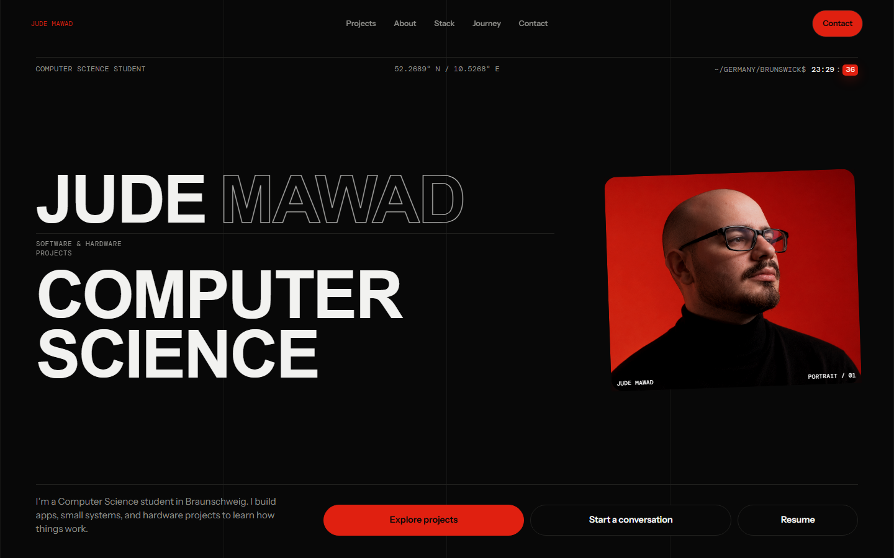

# Jude Mawad Portfolio

My personal portfolio showcasing software, hardware, and infrastructure projects.

**[judemawad.com](https://judemawad.com)**



## Projects

- **The Cube**: Voice-controlled physical computing system built around a Raspberry Pi 5.
- **IGNITE**:  Native iOS fitness and nutrition application.
- **Home Server**: Self-hosted Linux server and automation setup.

## Built with

HTML · CSS · JavaScript · Three.js

## Development

```bash
npm install
npm run dev
